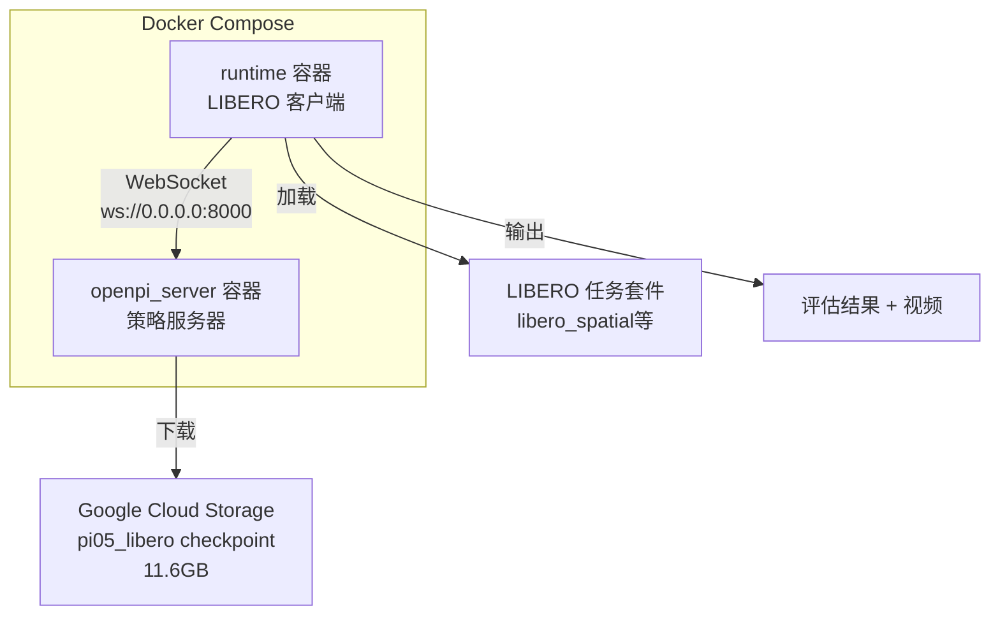
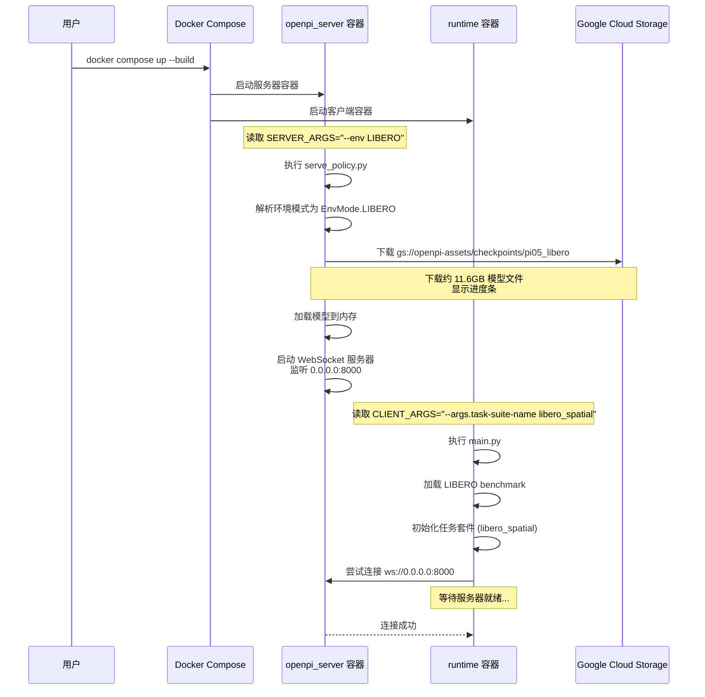
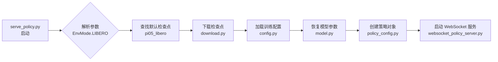
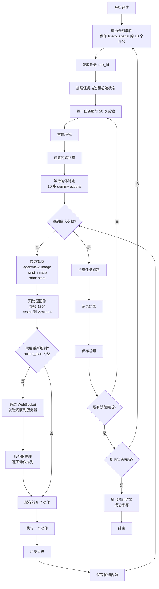

# LIBERO 基准测试

本示例运行 LIBERO 基准测试：https://github.com/Lifelong-Robot-Learning/LIBERO

注意：在更新此目录中的 requirements.txt 时，必须在 `uv pip compile` 命令中添加额外的标志 `--extra-index-url https://download.pytorch.org/whl/cu113`。

本示例需要初始化 git 子模块。不要忘记运行：

```bash
git submodule update --init --recursive
```

## 代码流程详解

本节详细说明客户端和服务器之间的交互流程，以及策略推理的内部机制。

### 1. 系统架构

系统采用客户端-服务器架构：
- **客户端** ([main.py](main.py))：运行 LIBERO 仿真环境，收集观察数据并执行动作
- **服务器** ([../../scripts/serve_policy.py](../../scripts/serve_policy.py))：加载 PI0 模型并提供推理服务
- **通信协议**：基于 WebSocket 的自定义协议，使用 msgpack 序列化

### 2. 客户端推理流程

客户端在 [main.py](main.py) 的主循环中执行以下步骤：

#### 2.1 初始化客户端
```python
# 第 79 行：创建 WebSocket 客户端
client = _websocket_client_policy.WebsocketClientPolicy(args.host, args.port)
```

客户端实现位于 [../../packages/openpi-client/src/openpi_client/websocket_client_policy.py](../../packages/openpi-client/src/openpi_client/websocket_client_policy.py)。初始化时会：
1. 建立 WebSocket 连接（第 26-40 行）
2. 接收服务器发送的元数据（第 38 行）

#### 2.2 收集观察数据

在每个时间步（[main.py](main.py) 第 113-131 行），客户端：

1. **图像预处理**（第 117-126 行）：
   ```python
   # 旋转图像 180 度以匹配训练数据预处理
   img = np.ascontiguousarray(obs["agentview_image"][::-1, ::-1])
   wrist_img = np.ascontiguousarray(obs["robot0_eye_in_hand_image"][::-1, ::-1])
   # 调整大小并填充到 224x224
   img = image_tools.resize_with_pad(img, args.resize_size, args.resize_size)
   ```

2. **构造观察字典**（第 131-143 行）：
   ```python
   element = {
       "observation/image": img,                    # 主摄像头图像
       "observation/wrist_image": wrist_img,        # 手腕摄像头图像
       "observation/state": np.concatenate(...),    # 机器人状态（位置+姿态+夹爪）
       "prompt": str(task_description),             # 任务描述（自然语言）
   }
   ```

#### 2.3 请求动作预测

客户端通过 [WebsocketClientPolicy.infer()](../../packages/openpi-client/src/openpi_client/websocket_client_policy.py#L46) 方法发送观察数据：

1. **序列化观察**（第 47 行）：
   ```python
   data = self._packer.pack(obs)  # 使用 msgpack 序列化
   ```

2. **发送请求**（第 48 行）：
   ```python
   self._ws.send(data)  # 通过 WebSocket 发送二进制数据
   ```

3. **接收响应**（第 49-52 行）：
   ```python
   response = self._ws.recv()
   return msgpack_numpy.unpackb(response)  # 反序列化动作数据
   ```

#### 2.4 执行动作

客户端收到动作序列后（[main.py](main.py) 第 146-150 行）：
```python
# 动作序列：[action_horizon, action_dim]，例如 [15, 7]
action_chunk = client.infer(element)["actions"]
# 取前 replan_steps 步（默认 5 步）
action_plan.extend(action_chunk[:args.replan_steps])
# 逐步执行
action = action_plan.popleft()
obs, reward, done, info = env.step(action.tolist())
```

### 3. 服务器处理流程

服务器端的处理流程涉及多个层次：

#### 3.1 服务器初始化

在 [serve_policy.py](../../scripts/serve_policy.py) 的 `main` 函数中（第 100-121 行）：

1. **加载策略模型**（第 100 行）：
   ```python
   policy = create_policy(args)  # 从检查点加载 PI0 模型
   ```

2. **创建 WebSocket 服务器**（第 109-114 行）：
   ```python
   server = websocket_policy_server.WebsocketPolicyServer(
       policy=policy,
       host="0.0.0.0",
       port=args.port,
       metadata=policy_metadata,
   )
   ```

#### 3.2 处理推理请求

WebSocket 服务器实现位于 [../../src/openpi/serving/websocket_policy_server.py](../../src/openpi/serving/websocket_policy_server.py)。

当收到客户端请求时（第 49-76 行）：

1. **接收并反序列化观察数据**（第 57 行）：
   ```python
   obs = msgpack_numpy.unpackb(await websocket.recv())
   ```

2. **调用策略推理**（第 60 行）：
   ```python
   action = self._policy.infer(obs)
   ```

3. **返回动作预测**（第 69 行）：
   ```python
   await websocket.send(packer.pack(action))
   ```

#### 3.3 策略推理

策略类实现位于 [../../src/openpi/policies/policy.py](../../src/openpi/policies/policy.py)。

`Policy.infer()` 方法（第 66-107 行）执行以下步骤：

1. **输入转换**（第 68-78 行）：
   ```python
   # 应用数据转换（归一化等）
   inputs = self._input_transform(inputs)
   # 转换为 JAX 数组并添加批次维度
   inputs = jax.tree.map(lambda x: jnp.asarray(x)[np.newaxis, ...], inputs)
   ```

2. **调用模型采样**（第 88-89 行）：
   ```python
   observation = _model.Observation.from_dict(inputs)
   outputs = {
       "actions": self._sample_actions(sample_rng_or_pytorch_device, observation, **sample_kwargs),
   }
   ```

3. **输出转换**（第 94-97 行）：
   ```python
   # 移除批次维度并转换回 numpy
   outputs = jax.tree.map(lambda x: np.asarray(x[0, ...]), outputs)
   outputs = self._output_transform(outputs)
   ```

#### 3.4 PI0 模型推理

PI0 模型的核心推理逻辑位于 [../../src/openpi/models/pi0.py](../../src/openpi/models/pi0.py)。

`sample_actions()` 方法（第 458-576 行）使用流匹配算法生成动作：

**步骤 1：编码前缀（条件信息）**（第 470-479 行）：
```python
prefix_tokens, prefix_mask, prefix_ar_mask = self.embed_prefix(observation)
# 包括：
# - 图像编码：通过 SigLIP 将图像转换为 patch tokens（第 243-255 行）
# - 语言编码：通过 Gemma 嵌入层处理任务描述（第 257-264 行）
```

**步骤 2：构建 KV 缓存**（第 480-485 行）：
```python
# 对前缀部分执行一次前向传播，缓存键值对以加速后续步骤
_, kv_cache = self.PaliGemma.llm([prefix_tokens, None], 
                                  mask=prefix_attn_mask, 
                                  positions=positions)
```

**步骤 3：ODE 积分生成动作**（第 567-574 行）：
```python
# 从纯噪声（t=1）逐步去噪到目标分布（t=0）
def step(carry):
    x_t, time = carry
    # 编码当前噪声动作和时间步（第 504-507 行）
    suffix_tokens, suffix_mask, suffix_ar_mask, adarms_cond = self.embed_suffix(
        observation, x_t, jnp.broadcast_to(time, batch_size)
    )
    # 通过 Transformer 预测速度场（第 541-548 行）
    (prefix_out, suffix_out), _ = self.PaliGemma.llm(
        [None, suffix_tokens],  # 重用前缀缓存
        mask=full_attn_mask,
        positions=positions,
        kv_cache=kv_cache,
        adarms_cond=[None, adarms_cond],
    )
    v_t = self.action_out_proj(suffix_out[:, -self.action_horizon :])
    # 欧拉积分：x_{t+dt} = x_t + dt * v_t（第 551 行）
    return x_t + dt * v_t, time + dt

# 循环执行 num_steps 次（默认 10 步）
x_0, _ = jax.lax.while_loop(cond, step, (noise, 1.0))
return x_0  # 返回去噪后的动作序列
```

### 4. 关键数据结构

**观察数据格式**（客户端 → 服务器）：
```python
{
    "observation/image": np.ndarray,        # 形状 [224, 224, 3], uint8
    "observation/wrist_image": np.ndarray,  # 形状 [224, 224, 3], uint8
    "observation/state": np.ndarray,        # 形状 [8], float32（位置3 + 姿态3 + 夹爪2）
    "prompt": str,                          # 任务描述，例如 "put the spatula on the plate"
}
```

**动作响应格式**（服务器 → 客户端）：
```python
{
    "actions": np.ndarray,  # 形状 [action_horizon, 7], float32
                            # action_horizon 通常为 15
                            # 7 维：末端执行器位置(3) + 姿态(3) + 夹爪(1)
    "server_timing": {
        "infer_ms": float,  # 推理耗时（毫秒）
    },
    "policy_timing": {
        "infer_ms": float,  # 策略耗时（毫秒）
    }
}
```

### 5. 流程图

```
[LIBERO 环境] ──观察──> [客户端 main.py]
                           │
                           │ element = {
                           │   "observation/image": img,
                           │   "observation/wrist_image": wrist_img,
                           │   "observation/state": state,
                           │   "prompt": task_description
                           │ }
                           ↓
                   [WebSocket Client] ──msgpack──> [WebSocket Server]
                                                           │
                                                           │ obs
                                                           ↓
                                                    [Policy.infer()]
                                                           │
                                                           │ 数据转换
                                                           ↓
                                                    [PI0.sample_actions()]
                                                           │
                                                           ├─> [embed_prefix()] 编码图像+语言
                                                           │   └─> SigLIP + Gemma
                                                           │
                                                           ├─> [构建 KV 缓存]
                                                           │
                                                           └─> [ODE 积分循环]
                                                               ├─> [embed_suffix()] 编码噪声动作+时间
                                                               ├─> [Transformer] 预测速度场
                                                               └─> [欧拉积分] 更新动作
                                                                   │ (重复 num_steps 次)
                                                                   ↓
                                                           返回去噪后的动作
                                                           │
                   [WebSocket Client] <──msgpack── [WebSocket Server]
                           │
                           │ actions: [action_horizon, 7]
                           ↓
              [客户端执行前 replan_steps 步]
                           │
[LIBERO 环境] <──action──┘
```

## 使用 Docker（推荐）

```bash
# 授予 X11 服务器访问权限：
sudo xhost +local:docker

# 使用默认检查点和任务套件运行：
SERVER_ARGS="--env LIBERO" docker compose -f examples/libero/compose.yml up --build

# 改用 Mujoco 的 glx（如果遇到 egl 错误时使用）：
MUJOCO_GL=glx SERVER_ARGS="--env LIBERO" docker compose -f examples/libero/compose.yml up --build
```

你可以通过提供额外的 `SERVER_ARGS` 来自定义加载的检查点（参见 `scripts/serve_policy.py`），并通过提供额外的 `CLIENT_ARGS` 来自定义 LIBERO 任务套件（参见 `examples/libero/main.py`）。
例如：

```bash
# 加载自定义检查点（位于顶层 openpi/ 目录中）：
export SERVER_ARGS="--env LIBERO policy:checkpoint --policy.config pi05_libero --policy.dir ./my_custom_checkpoint"

# 运行 libero_10 任务套件：
export CLIENT_ARGS="--args.task-suite-name libero_10"
```

## 不使用 Docker（不推荐）

终端窗口 1：

```bash
# 创建虚拟环境
uv venv --python 3.8 examples/libero/.venv
source examples/libero/.venv/bin/activate
uv pip sync examples/libero/requirements.txt third_party/libero/requirements.txt --extra-index-url https://download.pytorch.org/whl/cu113 --index-strategy=unsafe-best-match
uv pip install -e packages/openpi-client
uv pip install -e third_party/libero
export PYTHONPATH=$PYTHONPATH:$PWD/third_party/libero

# 运行仿真
python examples/libero/main.py

# 改用 Mujoco 的 glx（如果遇到 egl 错误时使用）：
MUJOCO_GL=glx python examples/libero/main.py
```

终端窗口 2：

```bash
# 运行服务器
uv run scripts/serve_policy.py --env LIBERO
```

## 结果

如果你想重现以下数字，可以评估位于 `gs://openpi-assets/checkpoints/pi05_libero/` 的检查点。该检查点是在 openpi 中使用 `pi05_libero` 配置训练的。

| 模型 | Libero Spatial | Libero Object | Libero Goal | Libero 10 | 平均值 |
|-------|---------------|---------------|-------------|-----------|---------|
| π0.5 @ 30k (微调) | 98.8 | 98.2 | 98.0 | 92.4 | 96.85

### 使用 Docker 复现结果

首先，授予 X11 服务器访问权限：
```bash
sudo xhost +local:docker
```

然后，分别运行每个任务套件进行评估：

```bash
# 1. 评估 Libero Spatial
export SERVER_ARGS="--env LIBERO policy:checkpoint --policy.config pi05_libero"
export CLIENT_ARGS="--args.task-suite-name libero_spatial"
docker compose -f examples/libero/compose.yml up --build

# 2. 评估 Libero Object
export SERVER_ARGS="--env LIBERO policy:checkpoint --policy.config pi05_libero"
export CLIENT_ARGS="--args.task-suite-name libero_object"
docker compose -f examples/libero/compose.yml up --build

# 3. 评估 Libero Goal
export SERVER_ARGS="--env LIBERO policy:checkpoint --policy.config pi05_libero"
export CLIENT_ARGS="--args.task-suite-name libero_goal"
docker compose -f examples/libero/compose.yml up --build

# 4. 评估 Libero 10
export SERVER_ARGS="--env LIBERO policy:checkpoint --policy.config pi05_libero"
export CLIENT_ARGS="--args.task-suite-name libero_10"
docker compose -f examples/libero/compose.yml up --build
```

每次运行会自动从 Google Cloud Storage 下载 `pi05_libero` 检查点并评估相应的任务套件。评估结果会显示每个任务的成功率。

## 实现流程详解

### 整体架构

LIBERO 示例采用**客户端-服务器架构**，通过 WebSocket 进行通信：



### 执行流程

#### 1. 启动阶段

**命令执行：**
```bash
export SERVER_ARGS="--env LIBERO"
export CLIENT_ARGS="--args.task-suite-name libero_spatial"
docker compose -f examples/libero/compose.yml up --build
```

**流程图：**


**关键代码文件：**
- Docker Compose 配置：[compose.yml](compose.yml)
- 服务器启动：[../../scripts/serve_policy.py](../../scripts/serve_policy.py)
- 客户端启动：[main.py](main.py)

#### 2. 模型加载阶段

**服务器端流程：**



**关键代码路径：**
1. [../../scripts/serve_policy.py#L73-L76](../../scripts/serve_policy.py#L73-L76) - 定义 LIBERO 默认检查点
2. [../../src/openpi/shared/download.py](../../src/openpi/shared/download.py) - 下载模型文件
3. [../../src/openpi/policies/policy_config.py#L57](../../src/openpi/policies/policy_config.py#L57) - 创建训练好的策略
4. [../../src/openpi/serving/websocket_policy_server.py](../../src/openpi/serving/websocket_policy_server.py) - WebSocket 服务器实现

#### 3. 评估循环

**主循环流程：**



**关键代码段：**

1. **任务初始化** - [main.py#L53-L63](main.py#L53-L63)
```python
# 初始化 LIBERO 任务套件
benchmark_dict = benchmark.get_benchmark_dict()
task_suite = benchmark_dict[args.task_suite_name]()
num_tasks_in_suite = task_suite.n_tasks
```

2. **主评估循环** - [main.py#L77-L103](main.py#L77-L103)
```python
for task_id in tqdm.tqdm(range(num_tasks_in_suite)):
    task = task_suite.get_task(task_id)
    initial_states = task_suite.get_task_init_states(task_id)
    env, task_description = _get_libero_env(task, LIBERO_ENV_RESOLUTION, args.seed)
    
    for episode_idx in tqdm.tqdm(range(args.num_trials_per_task)):
        # 执行一个 episode
```

3. **观察预处理** - [main.py#L112-L125](main.py#L112-L125)
```python
# 旋转 180 度匹配训练预处理
img = np.ascontiguousarray(obs["agentview_image"][::-1, ::-1])
wrist_img = np.ascontiguousarray(obs["robot0_eye_in_hand_image"][::-1, ::-1])
img = image_tools.resize_with_pad(img, args.resize_size, args.resize_size)
```

4. **策略查询** - [main.py#L128-L147](main.py#L128-L147)
```python
if not action_plan:
    element = {
        "observation/image": img,
        "observation/wrist_image": wrist_img,
        "observation/state": np.concatenate(...),
        "prompt": str(task_description),
    }
    action_chunk = client.infer(element)["actions"]
    action_plan.extend(action_chunk[:args.replan_steps]) # 将action chunk的前replan_steps步加入缓存
```

5. **动作执行** - [main.py#L149-L154](main.py#L149-L154)
```python
action = action_plan.popleft() # 从缓存中取出下一个动作，取出后从缓存中删除
obs, reward, done, info = env.step(action) # 执行动作，更新环境状态
```

#### 4. 数据流

```mermaid
graph LR
    A[MuJoCo 仿真器] -->|原始观察| B[LIBERO 环境]
    B -->|agentview_image<br/>256x256| C[图像预处理]
    B -->|wrist_image<br/>256x256| C
    B -->|robot state<br/>EEF pos/quat/gripper| C
    
    C -->|旋转 180°| D[Resize + Pad]
    D -->|224x224 RGB| E[构建观察字典]
    
    E -->|+ task prompt| F[WebSocket 客户端]
    F -->|JSON| G[WebSocket 服务器]
    G -->|解析| H[策略模型<br/>PI0.5-LIBERO]
    
    H -->|视觉编码| I[SigLIP ViT]
    H -->|语言编码| J[PaliGemma Tokenizer]
    I --> K[Transformer<br/>PaliGemma]
    J --> K
    K -->|动作头| L[Flow Matching<br/>预测动作序列]
    
    L -->|JSON| M[WebSocket 响应]
    M -->|actions array| N[客户端缓存]
    N -->|逐步执行| O[MuJoCo 仿真器]
```



### 关键参数说明

#### 服务器参数 (SERVER_ARGS)

在 [../../scripts/serve_policy.py](../../scripts/serve_policy.py) 中定义：

| 参数 | 默认值 | 说明 |
|------|--------|------|
| `--env` | `LIBERO` | 环境模式，决定加载哪个检查点 |
| `--port` | `8000` | WebSocket 服务器监听端口 |
| `--default-prompt` | `None` | 默认任务提示（LIBERO 从任务套件获取） |

#### 客户端参数 (CLIENT_ARGS)

在 [main.py#L20-L43](main.py#L20-L43) 中定义：

| 参数 | 默认值 | 说明 |
|------|--------|------|
| `--args.task-suite-name` | `libero_spatial` | 任务套件名称 |
| `--args.host` | `0.0.0.0` | 策略服务器地址 |
| `--args.port` | `8000` | 策略服务器端口 |
| `--args.resize-size` | `224` | 图像 resize 尺寸 |
| `--args.replan-steps` | `5` | 每次重新规划前执行的步数 |
| `--args.num-steps-wait` | `10` | 等待物体稳定的步数 |
| `--args.num-trials-per-task` | `50` | 每个任务的试验次数 |
| `--args.video-out-path` | `data/libero/videos` | 视频输出路径 |

### 性能优化要点

1. **动作缓存机制**：策略一次预测多步动作，客户端缓存并逐步执行，减少网络往返次数
2. **图像预处理**：在客户端完成 resize 和格式转换，减轻服务器负担
3. **重新规划策略**：每 5 步重新查询策略，平衡响应性和效率
4. **批处理推理**：服务器端支持并发处理多个请求（WebSocket 异步）

### 文件结构总览

```
openpi/
├── examples/libero/
│   ├── main.py                    # 客户端主程序
│   ├── compose.yml                # Docker Compose 配置
│   ├── Dockerfile                 # 客户端容器定义
│   └── README.md                  # 本文档
├── scripts/
│   ├── serve_policy.py            # 服务器主程序
│   └── docker/
│       └── serve_policy.Dockerfile # 服务器容器定义
├── src/openpi/
│   ├── policies/
│   │   └── policy_config.py       # 策略配置和加载
│   ├── serving/
│   │   └── websocket_policy_server.py  # WebSocket 服务器
│   ├── models/
│   │   ├── model.py               # 模型定义
│   │   └── pi0.py                 # PI0 模型架构
│   ├── shared/
│   │   └── download.py            # 检查点下载工具
│   └── training/
│       └── config.py              # 训练配置
├── packages/openpi-client/
│   └── src/openpi_client/
│       ├── websocket_client_policy.py  # WebSocket 客户端
│       └── image_tools.py         # 图像处理工具
└── third_party/libero/            # LIBERO 基准测试库
```

### 故障排查

常见问题请参考主 README 中的故障排查部分。LIBERO 特定问题：

**问题 1：模型下载中断**
- **症状**：`OUT_OF_RANGE` 错误，文件损坏
- **解决**：删除缓存 `rm -rf ~/.cache/openpi/openpi-assets/checkpoints/pi05_libero` 后重新运行

**问题 2：X11 显示问题**
- **症状**：无法显示 MuJoCo 窗口
- **解决**：运行 `sudo xhost +local:docker` 并设置 `MUJOCO_GL=glx`

**问题 3：GPU 内存不足**
- **症状**：CUDA out of memory
- **解决**：模型需要约 12GB GPU 内存，考虑使用更大的 GPU 或减小批处理大小
